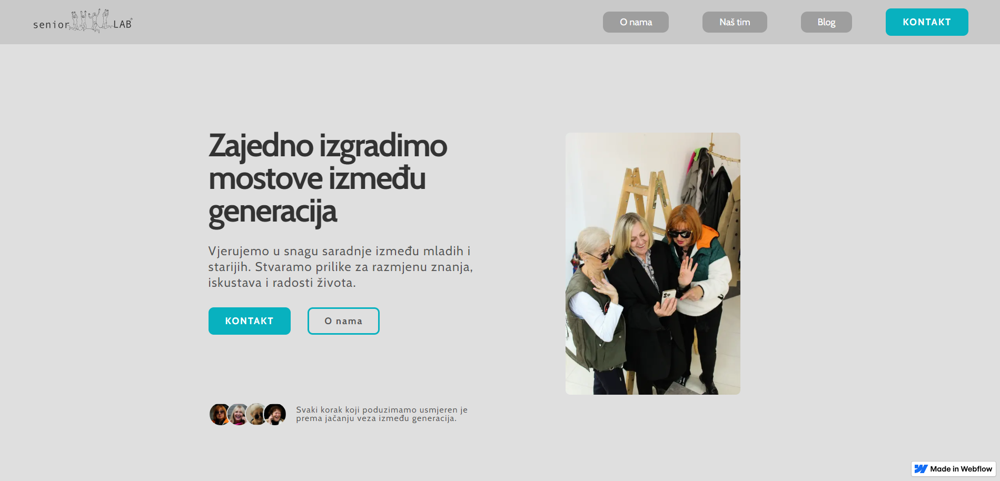
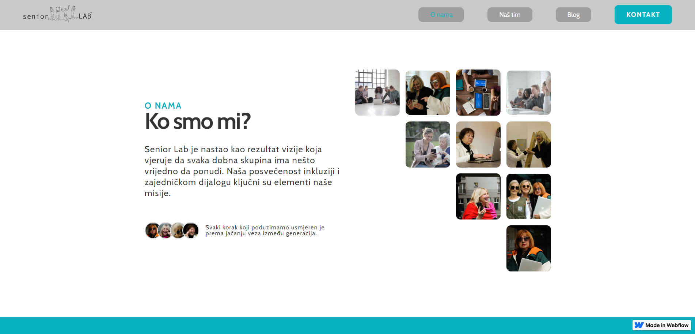

# SeniorLab: Supporting Digital Literacy for Seniors

Here you can see the website: [Live Demo](https://www.seniorlab.ba/)

## Project Description
SeniorLab is a platform designed to empower seniors by improving their digital literacy. The project provides an accessible and user-friendly interface tailored to the needs of older adults. With a focus on accessibility and simplicity, SeniorLab enables seniors to comfortably navigate and interact with the digital world.

---

## Features
- **Accessible Interface**: Tailored for older adults with larger text, simplified navigation, and clear instructions.
- **Digital Literacy Resources**: Tutorials and guides to help seniors learn digital skills.
- **User-Friendly Design**: Intuitive layouts designed for ease of use.
- **Responsive Design**: Optimized for use on all devices, including desktops, tablets, and smartphones.
- **Community Engagement**: Facilitates connections and collaborative learning among seniors.

---

## Technologies Used
- **Webflow**: For content structure.
- **Webflow**: For modern and responsive styling.
- **Webflow**: For interactive features.
- **Backend Framework**: Webflow.
- **Database**: Webflow.

---

## Setup Instructions
To run this project locally, follow these steps:

1. Clone the repository:
   ```bash
   git clone https://github.com/AndNijaz/SeniorLab.git
   ```

2. Navigate to the project directory:
   ```bash
   cd SeniorLab
   ```

3. Install dependencies (if applicable):
   ```bash
   npm install
   ```

4. Start the development server (if applicable):
   ```bash
   npm start
   ```

5. Open `http://localhost:3000` in your browser to view the project.

---

## Usage
The platform is designed for:
- **Seniors**: Learning and practicing digital skills.
- **Educators**: Teaching digital literacy to older adults.
- **Community Organizations**: Supporting digital inclusion initiatives.

---

## Screenshots

### Homepage


### About SeniorLab


> *Screenshots are stored in the `/img` directory.*

---

## Project Status
This project is **live and operational**. Future updates may include:
- Expanding tutorials and resources.
- Adding more interactive features like quizzes and progress tracking.
- Enhancing community engagement tools.

---

## Acknowledgements
Special thanks to collaborators and users who have contributed feedback and ideas for this project. SeniorLab aims to create a positive impact by bridging the digital divide for older adults.

---


